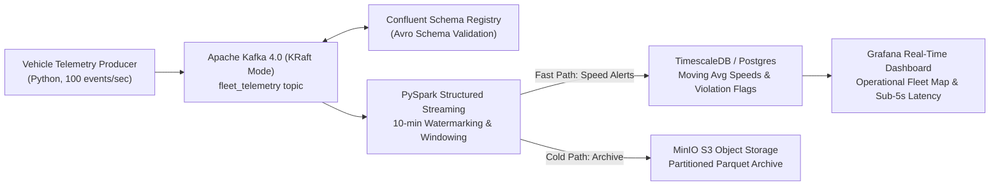

# 🏛️ PRJ-03 Architecture: Real-Time Fleet Telemetry

```mermaid
flowchart LR
    Gen["Vehicle Telemetry Producer<br/>(Python, 100 events/sec)"] --> Kafka["Apache Kafka 4.0 (KRaft Mode)<br/>fleet_telemetry topic"]
    Kafka <--> SR["Confluent Schema Registry<br/>(Avro Schema Validation)"]
    Kafka --> Spark["PySpark Structured Streaming<br/>10-min Watermarking & Windowing"]
    Spark -->|Fast Path: Speed Alerts| TS["TimescaleDB / Postgres<br/>Moving Avg Speeds & Violation Flags"]
    Spark -->|Cold Path: Archive| S3["MinIO S3 Object Storage<br/>Partitioned Parquet Archive"]
    TS --> Grafana["Grafana Real-Time Dashboard<br/>Operational Fleet Map & Sub-5s Latency"]
```
