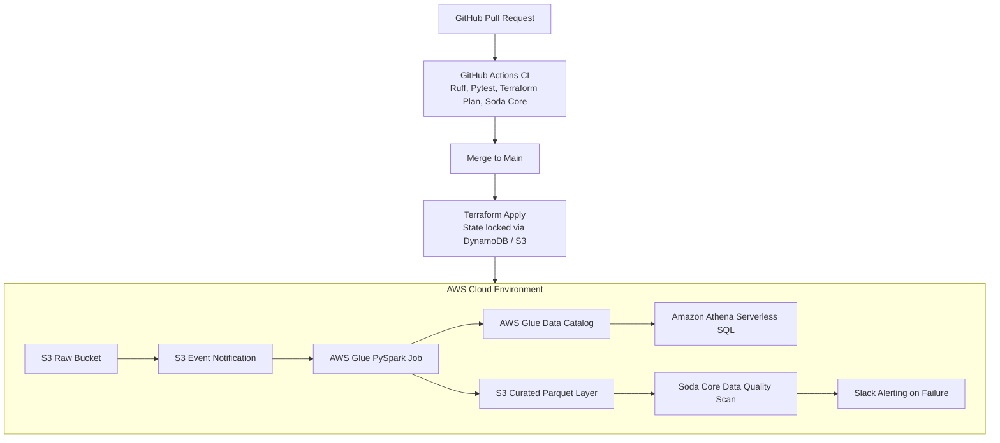

# 🏛️ PRJ-04 Architecture: AWS Cloud Platform (Terraform IaC)

```mermaid
flowchart TD
    PR["GitHub Pull Request"] --> CI["GitHub Actions CI<br/>Ruff, Pytest, Terraform Plan, Soda Core"]
    CI --> Merge["Merge to Main"]
    Merge --> Apply["Terraform Apply<br/>State locked via DynamoDB / S3"]
    Apply --> AWS["AWS Infrastructure"]
    
    subgraph AWS["AWS Cloud Environment"]
        S3Raw["S3 Raw Bucket"] --> Event["S3 Event Notification"]
        Event --> GlueJob["AWS Glue PySpark Job"]
        GlueJob --> S3Curated["S3 Curated Parquet Layer"]
        GlueJob --> Catalog["AWS Glue Data Catalog"]
        Catalog --> Athena["Amazon Athena Serverless SQL"]
        S3Curated --> Soda["Soda Core Data Quality Scan"]
        Soda --> Slack["Slack Alerting on Failure"]
    end
```
